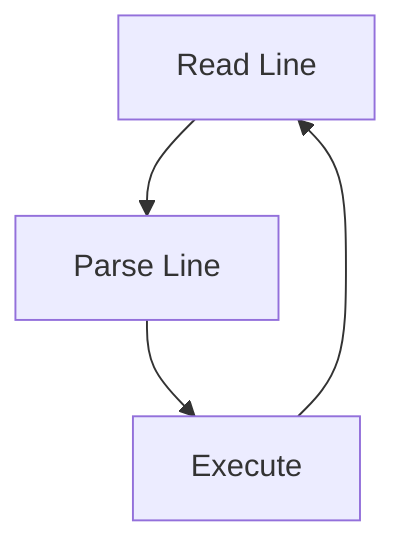
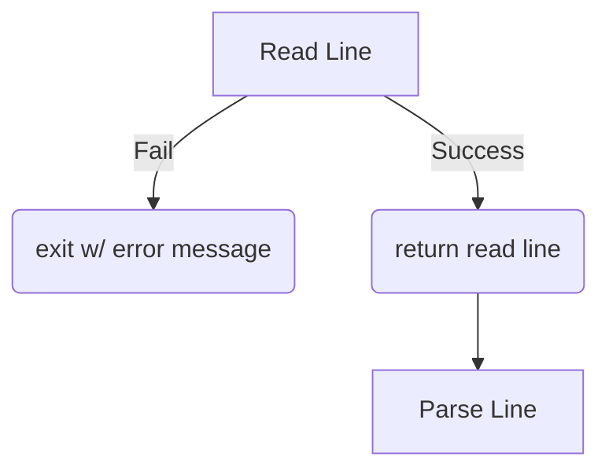
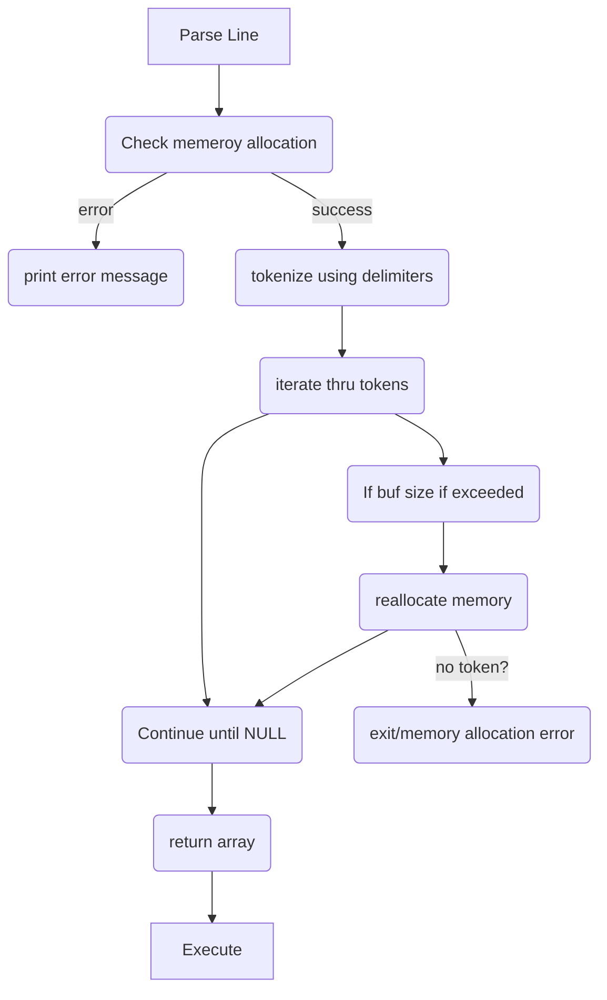
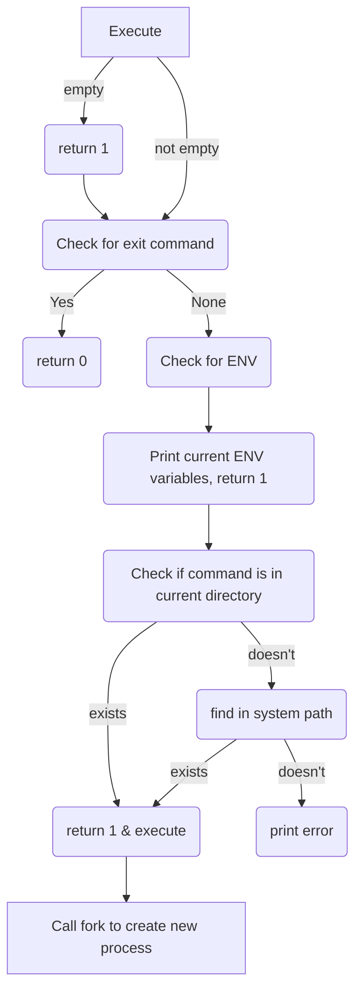
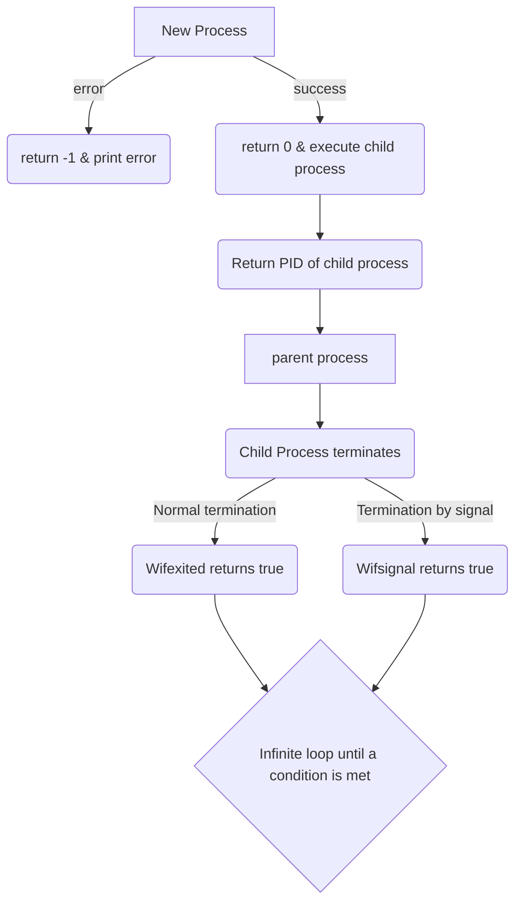

# Simple Shell

## Description
Simple Shell is a custom Unix shell implementaion. It aims to replicate the functionality of a traditional Unix shell, allowing users to execute commands and manage processes.

## Table of Contents
1. [Installation](#installation)
2. [Usage](#usage)
3. [Features](#features)
4. [Flowchart](#flowchart)
5. [Authors](#authors)
6. [Acknowledgments](#acknowledgments)

## Installation
To install and run Simple Shell, follow these steps:

1. **Clone the repository:**
```sh
git clone https://github.com/HarrisonGearhart/simple_shell.git
```
2. **Navigate to the project directory:**
```sh
cd simple_shell
```
3. **Compile the shell:**
```sh
gcc -Wall -Werror -Wextra -pedantic -std=gnu89 *.c -o hsh
```

## Usage
To use Simple Shell:

1. **Run the shell:**
```sh
./hsh
```
2. **Use commands as you would in a traditional Unix shell:**
```sh
($) /bin/ls
```

## Features
- Display a prompt and wait for user input.<br>
- Execute commands entered by the user.<br>
- Handle command lines with arguments.<br>
- Implement built-in commands like 'exit' and 'env'.<br>
- Use the PATH environment variable to locate executables.<br>
- Error handling and end-of-file (Ctrl+D) condition.

## Flowchart






## Authors
- **Ari Williams** - [AriRainbow](https://github.com/AriRainbow)<br>
- **Harrison Gearhart** - [HarrisonGearhart](https://github.com/HarrisonGearhart)

## Acknowledgments
- Inspired by the Unix shell.<br>
- Thanks to the open-source community for their valuable resources.
